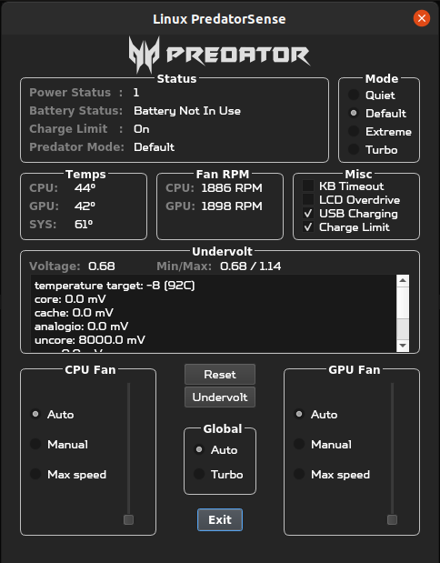

## NitroSense™ clone for ```AN515-46-R5WF```
### Controls fan speed, gaming modes and undervolting on Linux. This application is intended for Acer Nitro 5 AN515-46 model.



## Disclaimer:
* Secure Boot **IS** \* supported if you only use the ```acpi_ec``` package.
* Secure Boot is **NOT** \* supported if you want to control CPU voltage offsets using the ```msr-tools``` and ```amdctl``` packages.
* Using this application with other laptops may potentially damage them. Proceed at your discretion.

## Install:
- Get the latest [release](https://github.com/Packss/Linux-NitroSense/releases)
- Run ```sudo ./install.sh``` from inside the folder


## Usage:
### COMMAND LINE  
 - ```sudo``` is required in order to access the Super I/O EC registers and apply undervolt offsets.
  - From the command line run the main script as root:
  ```
  sudo python3 main.py
  ```

_[OPTIONAL]_
- Install ```amdctl``` for undervolt and voltage readings


### NVIDIA-POWERD
- After switching nitro modes \* **YOU MAY NEED TO RESTART NVIDIA-POWERD SERVICE IN ORDER TO DETECT NEW TGP** \*
```
sudo systemctl restart nvidia-powerd
``` 
- You can check the current GPU TGP via
```
nvidia-smi
```

## Dependencies [Development]:
* Ubuntu / Linux Mint:
  ```
  sudo apt-get install python3-pyqt5, python3-pyqt5.qtchart
  ```

  ```
  git clone https://github.com/musikid/acpi_ec/
  cd acpi_ec
  sudo ./install.sh
  modprobe acpi_ec
  sudo cat /dev/ec #confirm access to EC
  ```
 
* Fedora:
  ```
  sudo dnf install python3-qt5
  sudo dnf install python3-pyqtchart
  ```
  Make sure SecureBoot is off.

  ```
  sudo dnf install dkms
  
  git clone https://github.com/musikid/acpi_ec/
  cd acpi_ec
  sudo ./install.sh
  modprobe acpi_ec
  sudo cat /dev/ec #confirm access to EC
  ```

Packages:
* ```Python Qt5``` -> [PyQt5](https://pypi.org/project/PyQt5/)
* ```acpi_ec``` -> [acpi_ec by musikid](https://github.com/musikid/acpi_ec/)
* ```msr-tools``` -> [msr-tools by intel](https://github.com/intel/msr-tools)

## This is a fork of [PredatorSense by snowyoneill](https://github.com/snowyoneill/Linux-PredatorSense), customized for ```AN515-46-R5WF```

## Changelog:

Nothing yet
